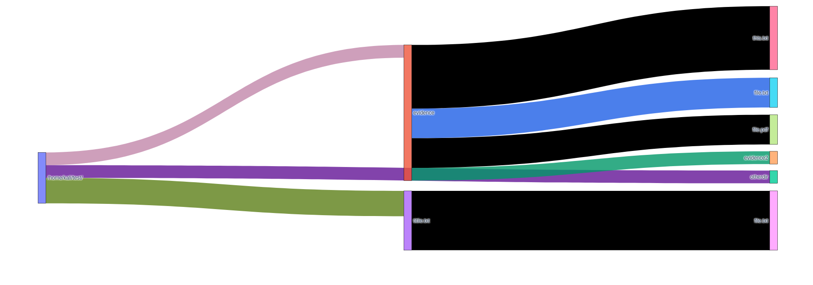
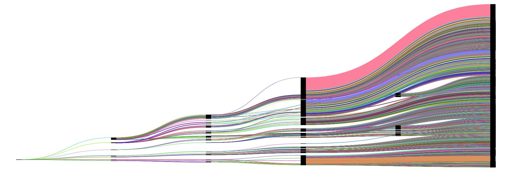
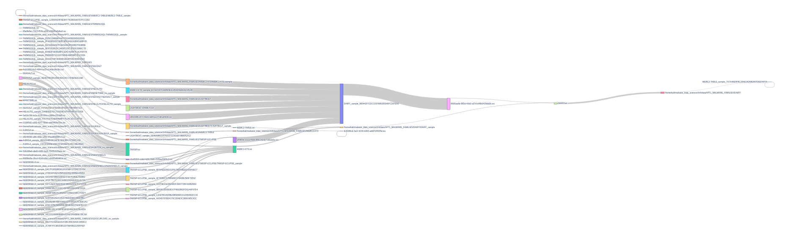

###### dirv
- dirv directory contains the more complete code. dirv.sh can be ran from environment variables to graph a directory of all filetypes by files. 
```python
python3 met-cap.py /path/to/directory output.json
```
A way to map a directory for plotly sankey-graph under the following conditions: 
	Plotly json format
	source : destination numbering
	colors for each source (excluding destinations)
	labels (for each source)
	size of filetype in a directory. 

- Directories connect to files each with filetypes.
-
# Example


# Large directory structure without labels


# Files with labels without colors:

